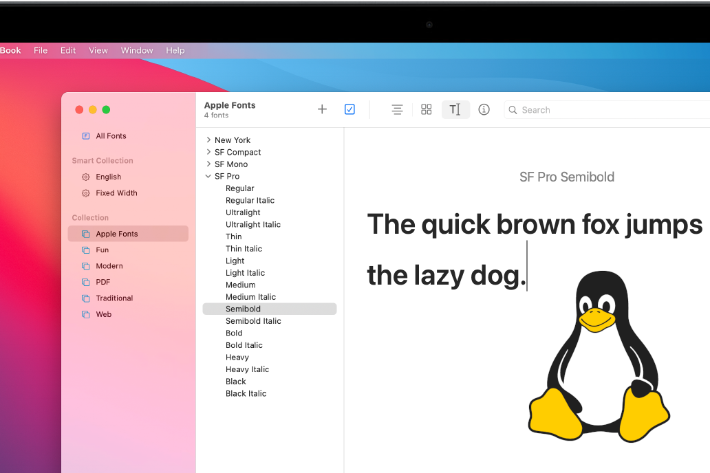

Here's a simple trick to install Apple's San Francisco typeface on Linux and use it where specified in web stylesheets. First, some background on why I did this and why it may be useful to you:

- I recently switched from a MacBook to a Lenovo laptop running Linux as my primary development machine. *Context: I've gone through 3 MacBooks in the past two years and all have developed hardware problems of some form or another. Yikes! The new Lenovo Yoga line is competitive with the Apple M1-based Macs, touchscreen is nice, lasting build quality is TBD. If you can break out of the Apple garden, the price-quality ratio hits just right.*
- I largely work on frontend code for the time being.
- Very few users of my company's product use anything other than Chrome or Safari on MacOS, so approximately correct rendering is important.

I also just happen to love the San Francisco typeface: it's balanced, legible, and friendly.

The following steps were performed on Fedora 34 and Brave, and should be applicable to almost any distro as well as any Chromium browser.

1. **Download TTF/OTF files of SF Pro Text from [this repository](https://github.com/blaisck/sfwin)**. You might as well avoid the official Apple website because their font downloads are in the form of Mac-specific disk images. Note that commercial use of Apple fonts is most likely against their EULA.
1. **Install the files** by copying them to `~/.local/share/fonts`, creating the directory if necessary. Refresh the font cache using `fc-cache -f -v`.
1. **Set SF Pro Text as the browser's standard and/or sans-serif font**. This is optional, but will result in the smoothest experience when a webpage's content has `font-family` unspecified or set to `sans-serif`. In Chrome, Brave, and probably other Chromium browsers, this setting is located under Appearance > Customize fonts.
1. **Install [Tampermonkey](https://www.tampermonkey.net/)**. Tampermonkey is a Chrome extension that lets you easily inject scripts onto webpages that match a certain pattern -- in our case we'll enable our script everywhere.
1. **Copy the following script** to Tampermonkey and reload any target pages:

```
// ==UserScript==
// @name         Force font
// @namespace    http://tampermonkey.net/
// @version      0.1
// @description  Sets the font on all websites to SF Pro Text
// @author       You
// @match        *://*/*
// @grant        none
// ==/UserScript==

(function() {
    const override = `font-weight: 100 900; src: local('SF Pro Text');`
    const fontFaceCSS = `
        @font-face {
            font-family: '-apple-system';
            ${override}
        }
        @font-face {
            font-family: 'BlinkMacSystemFont';
            ${override}
        }
        @font-face {
            font-family: 'x-locale-body';
            ${override}
        }
        @font-face {
            font-family: 'arial';
            ${override}
        }
        @font-face {
            font-family: 'sans-serif';
            ${override}
        }
    `
    const head = document.head || document.getElementsByTagName('head')[0],
        style = document.createElement('style')
    style.appendChild(document.createTextNode(fontFaceCSS))
    head.appendChild(style)
})();
```

This works because of [CSS font-family aliasing](https://www.zachleat.com/web/rename-font/), a technique used by Facebook in order to simplify system font declarations on their core app. The idea of using Tampermonkey to inject the styles came from [this SO post](https://superuser.com/questions/1209191/force-chrome-to-use-my-preferred-font-over-the-authors), but the answer which proposes its use is doubly inefficient because it uses the CSS `*` selector and iteration over DOM elements. In my experience, inline styles may still be overridden if the site uses SCSS (such as on GitHub), and `!important` is no workaround.

This solution may still result in a flash of switched fonts upon page load, but is still faster than iterating over DOM elements, and is less permanent than, say, creating a local TTF named `-apple-system`. Note that in the example here, I've made the opinionated choice to also override `arial`, a rather ugly font.

Hope this helps! Happy font rendering.
