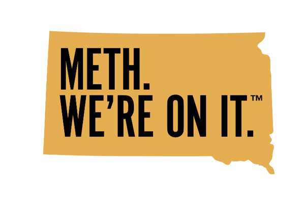

  The logo from South Dakota’s anti-methamphetamine campaign.

### &nbsp;

The state of South Dakota just launched a controversial methamphetamine addiction awareness campaign centered around the slogan “Meth. We’re On It.” The campaign consists of a strong visual identity (pictured above), still photos of South Dakotans affected by meth with the phrase “Meth. I’m On It” in large type, and video PSAs. The concept was executed by agency Broadhead Co.

The campaign has gone viral on a national level, with different groups vocalizing both strong support and strong disagreement with the tone and execution of the campaign. On Twitter, there are two main camps: those who thought the state was clueless, and others who saw the meaning as intentionally carrying two themes—admission that meth is a problem, and a drive to tackle it. Even among those who saw this double meaning, people were further divided. Some believed the messaging demeaned the state’s populace or projected a bad image of the state on a national level. Others believed the campaign would be effective at drawing awareness and stirring South Dakotans to action, siding with Governor Noem and the ad agency.

Regardless, the governor and agency have stuck to their guns, so to speak—they have both released statements reaffirming their belief in the validity and effectiveness of this effort. Time will tell whether this campaign is successful in its overarching goal of alleviating the state’s meth addiction crisis, since this will depend on a number of legislative factors and action by public and private groups, but in the short-term, it has propelled conversations about this issue into the mainstream.

I think this campaign will be effective because it starts the discussion around a difficult issue by confronting it directly. Because the messaging is so controversial, many will ask the state “what were you thinking?”—this gives Gov. Noem an excellent opportunity to dive into the specifics of the scope of the problem as well as planned and continuing efforts to address it. Additionally, it uses a communication tactic common to addiction recovery programs: admitting the problem first. Think Alcoholics Anonymous meetings: “I am an alcoholic” is the equalizer, the starting point for everyone in the room to feel a shared sense of responsibility and the drive to work through their issues together.

The nationalization of local- and state-level politics is a structural factor that will work to the benefit of this campaign, as well. This new tendency for American politics to concern mostly national issues manifests as state politicians campaigning on their alignment with or against the Trump administration, and by projecting their views on issues like gun control, women’s rights, or criminal justice at the national level which generally align with the views of one major party. Groups like the NRA, Planned Parenthood, and the ACLU (which pursue action in all 50 states) are louder than ever, and state and local politicians use their alignments with these groups to promote their visions for America, not just for their states.

Addiction is one such issue which crosses state lines. While some predict this campaign will make the state a laughingstock, others see the opportunity for South Dakota to sound the alarm and thereby bring other states into the conversation, creating unity rather than discord. Indeed, the ACLU said in August that reducing “ingestion of controlled substance” penalties from felony to misdemeanor status would save the state $50MM in costs related to the incarceration of these offenders. Those who object to the state’s large expenditure of just under $0.5MM so far on a total contract of $1.4MM with Broadhead Co. would do well to remember that the state could divert funds from “tough on crime” policies to fund comprehensive treatment programs, and yes, would still have some money left over to buy ads.

----

- *Overview of the campaign, details on the state’s concurrent efforts to address the addiction crisis:* https://www.argusleader.com/story/news/politics/2019/11/18/gov-kristi-noem-launches-anti-meth-campaign-meth-were-it/4227949002/
- *Responses to the provocative messaging of the campaign:* https://www.nytimes.com/2019/11/18/us/south-dakota-meth.html?smtyp=cur&smid=tw-nytimes
- *On the good, the bad, and the ugly of nationalized political discourse:* https://www.vox.com/polyarchy/2018/5/31/17406590/local-national-political-institutions-polarization-federalism) 
- *The ACLU’s plan for a “Smart Justice” approach to drug offenses in South Dakota:* https://www.aclusd.org/en/press-releases/aclu-south-dakota-recommends-smart-justice-approach-drug-related-offenses

