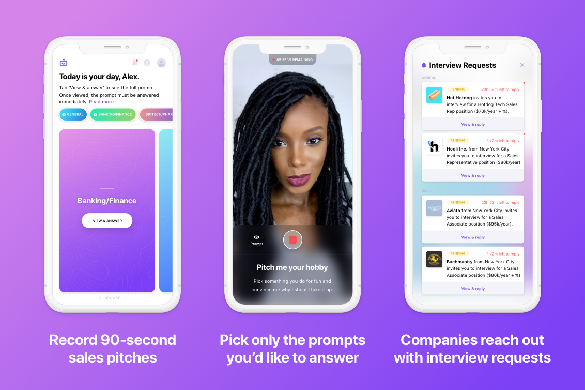

> A vision without execution is just a hallucination.

A dollar invested in scale does not teach the same lesson as a dollar spent getting to know one user well. 

At Showcase, the vision was to connect job-seeking candidates to companies using short videos as the first point of contact. We were going to be a **single, centralized application**: A candidate would log into our platform, submit short video responses to simple interview questions, and instantly apply to roles at dozens of companies with one click. This would eliminate the need for first-round phone screens, saving jobseekers and employers time.

When I joined the company as a marketing & communications intern in May 2019, I was impressed by the ability of then-solo founder & CEO Amay to organize a series of contractors to create a compelling visual identity and coherent UI. He had an iOS app in beta, and with his experience in tech investing, he was familiar with the KPIs a company should reach to be attractive to potential investors. Over six months, I would learn that his public-markets perspective couldn't make up for our operational failures.

At first, the candidate market would be salespeople in NYC in, or looking to work in, tech. The employer market would be Series A & B startups that needed to expand their sales teams to keep up with rapid growth. Video wouldn't be suited to technical roles (Triplebyte dominates that space regardless) but our solution would be perfect for customer-facing roles. Such was the hypothesis. In sales, it's the qualitative inputs that matter, right? *Sell me this pen. Change my mind about X.*

We had positive reception from sales recruiters and hiring managers. One night, I attended a round-table networking event for sales managers in hopes of pitching our solution to potential employers. At one point, the account manager sitting to my left told me there was a strict rule against pitching your own product or service. But then, from across the table, a sales recruiter whom I'd shared an elevator with chimed in, saying: "Listen. Showcase sounds great, and if I had this 20 years ago, this would've saved me so much time." She launched into a description of how the product worked—*she was pitching the product for me.* I walked away from that night with the business cards of everyone at that table.

## Adding value early in the customer journey
Our target customers didn't want to hear our company's pitch—they wanted to hear the experiences of people they respected in their industry. So, I invited a guest speaker to talk about his choice to move from an enterprise to a startup sales role in front of an audience of a dozen tech salespeople. While interviewing our guest, I fielded questions from the audience and got others to share their own stories. The central discussion topic was the idea of working at a startup, with our product being a means to this end. The difference between pitching the platform and pitching the opportunity is crucial. Consider another marketplace model, dating apps: the platform itself is not the draw, it's the prospect of meeting someone. Hinge, for example, [took this concept and ran with it](https://hinge.co/designed-to-be-deleted).

How do you build trust among your first 100 users and turn them into advocates for your brand? If you're Yelp, you [start with pizza, beer, and laughter](https://medium.com/swlh/building-yelp-bc4e62c4db3b). Yelp would invite a few dozen selected users to parties with the founding team and each other. Crucially, in-app engagement drove attendance at these events and vice versa: "Since the parties were reserved for prolific reviewers, they gave casual users a reason to use the site more and nonusers a reason to join."

*A "Yelp Elite" event in 2005. A few dozen selected users would be invited to these parties.*

> You'll be doing different things when you're acquiring users a thousand at a time, and growth has to slow down eventually. But if the market exists you can usually start by recruiting users manually and then gradually switch to less manual methods.
>
>
> *— Paul Graham, [Do Things that Don't Scale](http://paulgraham.com/ds.html)*

In Yelp's case, doing things that didn't scale was the only option with little cash on hand. But Showcase was bankrolled by half a million dollars in friends-and-family funding, and this gave us the illusion that we were further along than we were, making early investments in scale more appetizing than pizza parties. This focus on scale over user experience what led my vision for the company to gradually drift from that of the CEO.

The CEO was disappointed with the amount of time required to plan and follow up with event attendees, so we poured money into channels with wide reach and clearly measurable return on spend. Once we launched to the App Store, however, our conversion to signups was essentially nil. We didn't know what our market wanted to hear.

Nonetheless, we continued to optimize tiny details while ignoring the bigger picture. We brought our click-through rate on Facebook ads up from below 1% to around 2%. I produced an animated video ad and a longer-form [product demo video](https://vimeo.com/348680698). I redesigned our landing page to mimic the layout of another startup in our WeWork space that was doing very well. I implemented the [Branch API](https://branch.io/), which would provide deep attribution tracking and give the user the option to get a link to the app sent via text. I implemented referral campaigns with [ViralLoops](https://viral-loops.com/), but why would anyone refer a friend to a job board that hadn't gotten anyone hired? With cash to burn, we gave large amounts to anyone who could get even 5 emails on our platform.

With two excellent in-house software engineers and my own desire to learn the tools of digital marketing, our tendency to measure and tweak the tiniest product features only grew. After having little success in the tech sales industry (we did have a handful of people create accounts, but no placements) we decided to turn our focus to college students and recent grads. From paid market research, we also rethought our existing "reverse hiring" model wherein companies would reach out to candidates. Expanding from sales to a wider basket of industries, we populated the employer side of the app with listings aggregated from other career websites. A candidate would then be able to apply directly to multiple firms by name. We didn't explicitly build partnerships with these companies—Airbnb did the same with Craigslist rentals in their early days—but the idea was that we'd approach the company with a qualified pool of applicants.

Talk about disclaimer and final misgivings