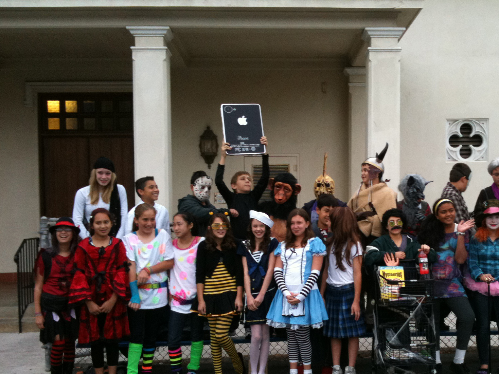
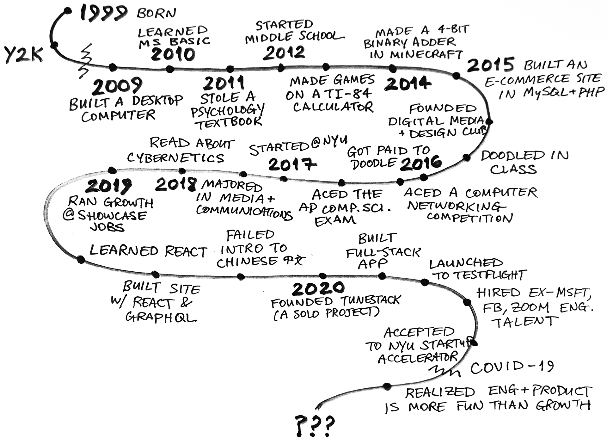
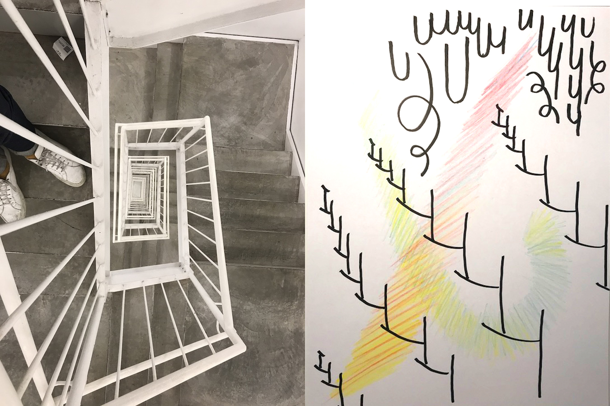

*But you can probably guess which 10-year-old kid is me in this photo:*

# My path starts here:

# The next step is a leap of faith.

From teaching myself my first programming language, Microsoft Visual BASIC, to [building and launching a music app](/code/tunestack), the last decade has been one crazy journey. I have studied psychology, art, and computer science in the most irreverent and self-directed ways possible.

I am looking for an opportunity to apply my abilities to create and break down complex systems. My interdisciplinary background and unstoppable curiosity will add value to any development team.

[Reach Out](/about)

