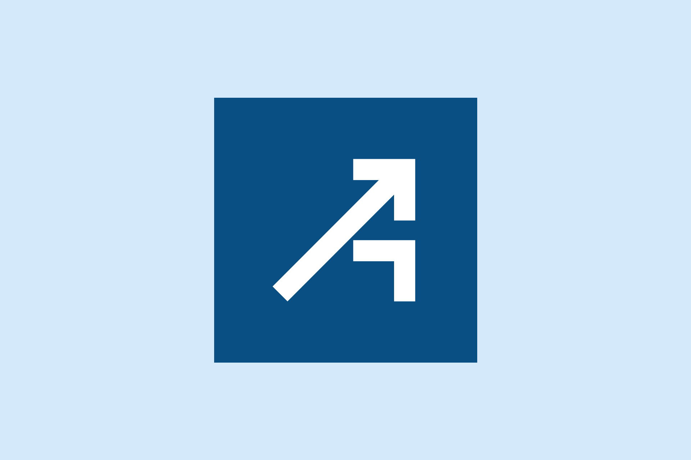
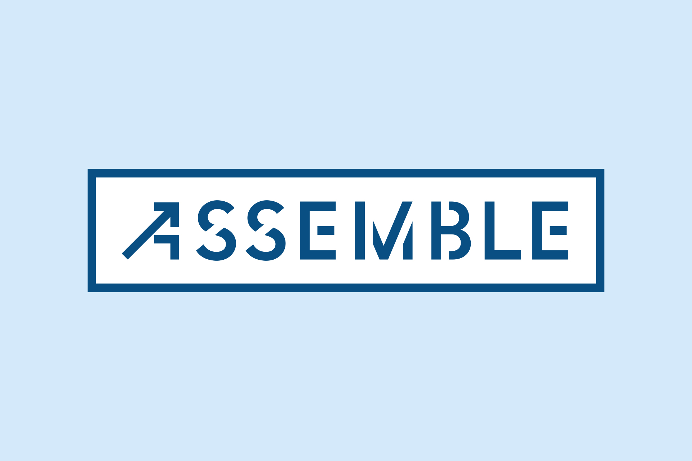
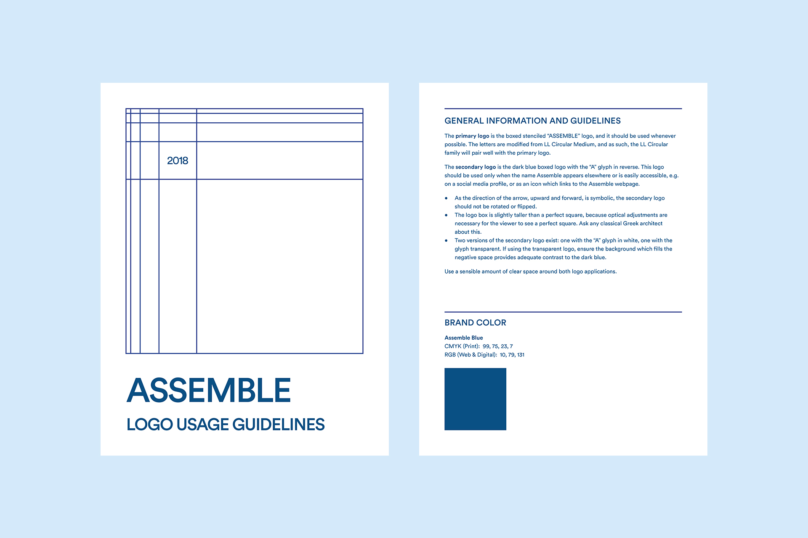
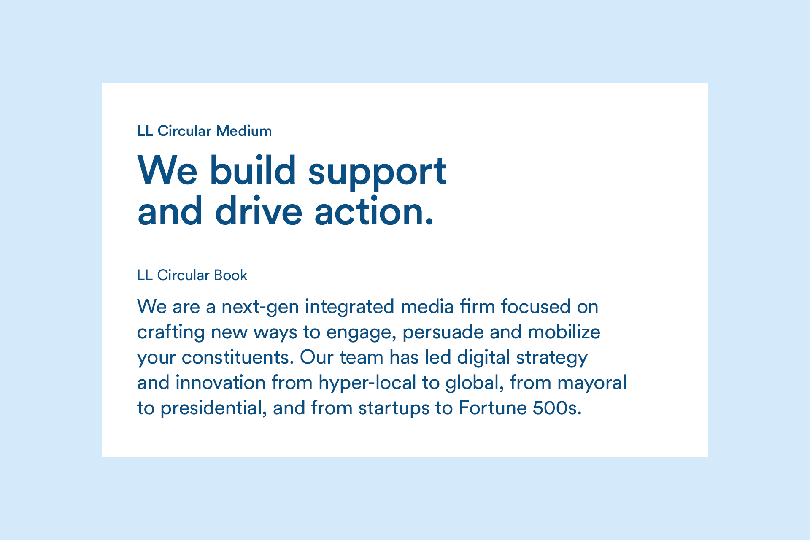
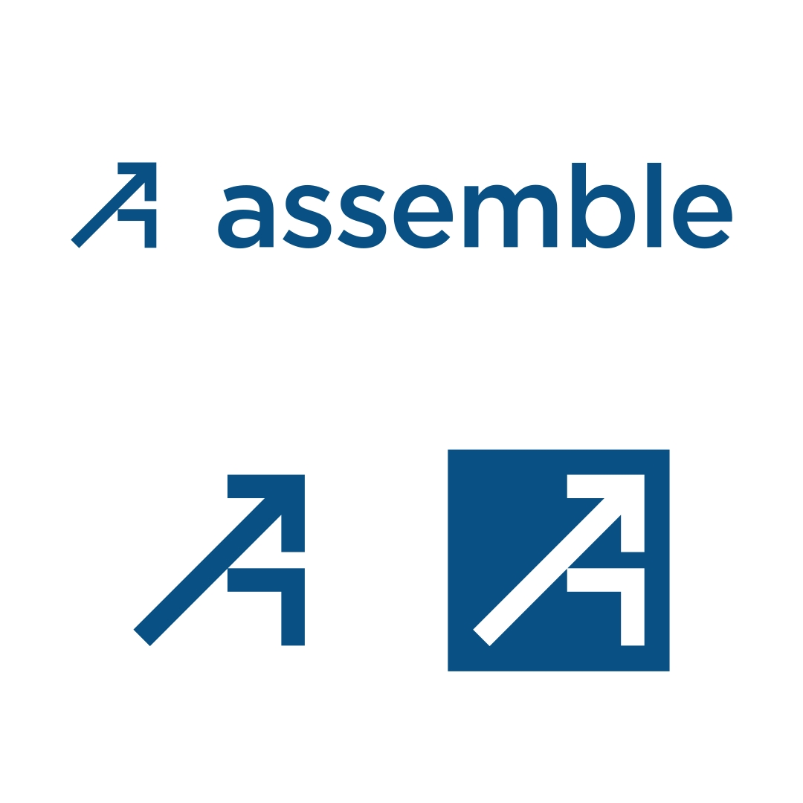
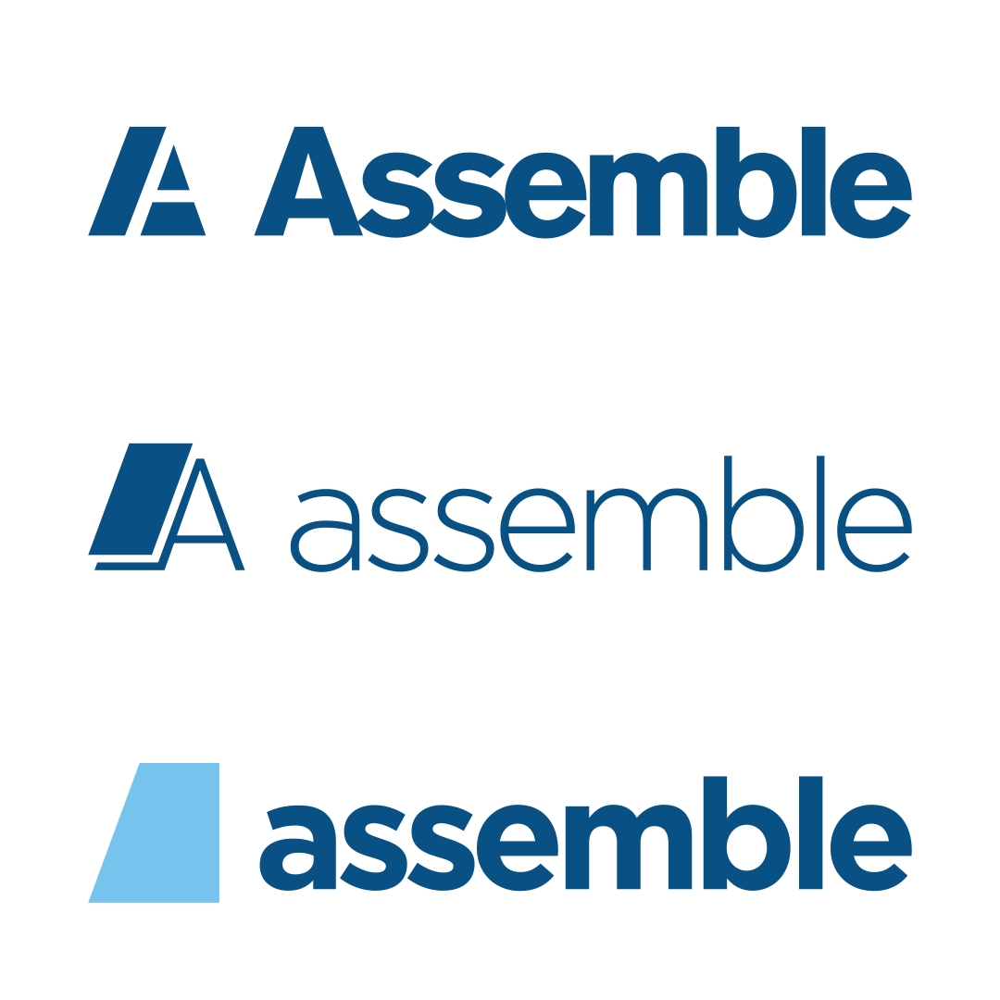

### In 2018, I designed a logo for [Assemble](https://www.assembletheagency.com/). The company, formerly known as Assemble the Agency, is a democratic political consulting firm headquartered in Washington, D.C. The company is led by a top strategist for the 2008 and 2012 Obama campaigns, and a former managing director at Politico. Final deliverables included two logo variants and color and type guidelines.

### The arrow icon neatly conveys progress, empowerment, triumph, openness, and unity. The client also wished to expand the “Assemble” metaphor of parts coming together.

## Final Deliverables

- 
- 
- 
- 

## Concept Development

- 
- 

### &nbsp;
