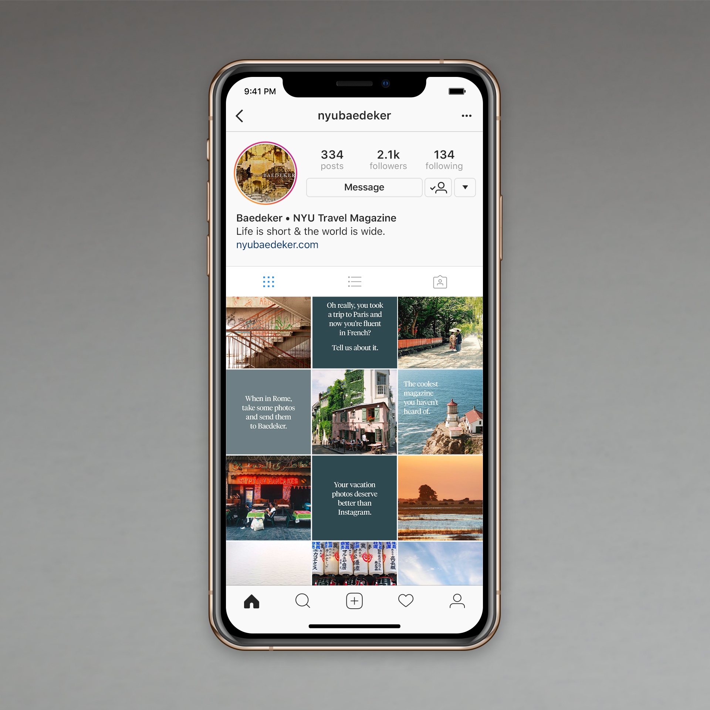

### Since August 2018, I have been the creative director of Baedeker, the NYU travel magazine. The magazine is published twice a year and consists entirely of student work: narrative content and photography. Students at our school are eager to share their experiences abroad, thanks in part to NYU’s expanding global presence and
 numerous study-abroad sites.

### I oversee a team of nine designers and three illustrators to produce this 36-page magazine once a semester. We also release web content on a rolling basis.

### &nbsp;

- 
- 

- 
- 

- 
- 

## Social media & digital strategy  
### The biggest constraints limiting on-campus awareness of our print edition are small distribution volume and pressure to be selective with what we publish. Because of our limited budget, we can only order so many copies (Baedeker is free for students), and because we keep the print edition under 40 pages, we cannot publish the vast majority of submitted articles.  

### I redesigned our website and created a plan to publish certain articles as web-only. While we can't publish everything we receive, word-of-mouth is the main driver of awareness for Baedeker, and people will be more likely to tell their friends about the magazine if their work is published. With this cohesive strategy, we can release more content across all channels and build awareness without increasing budget.

### &nbsp;

