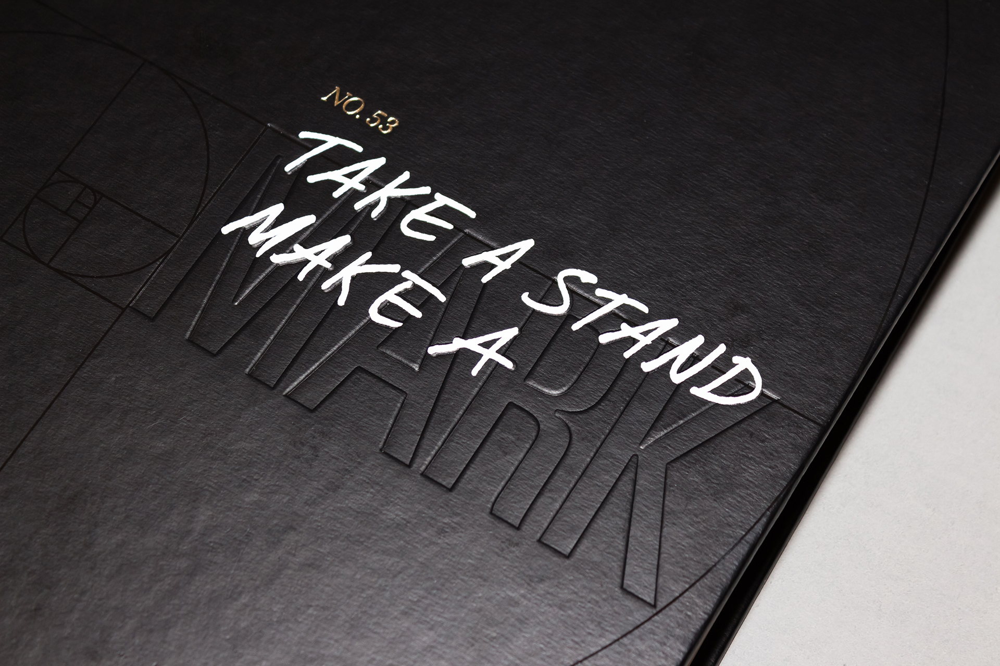
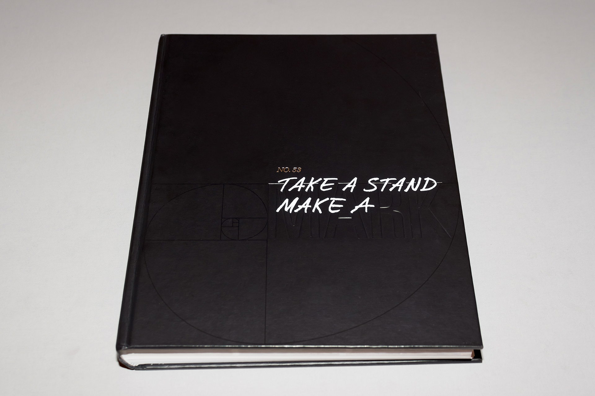
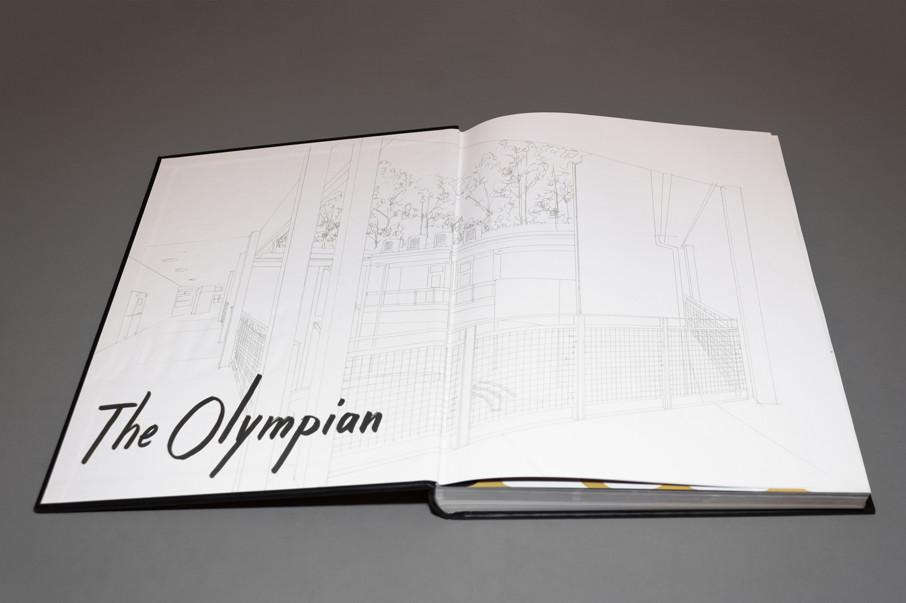
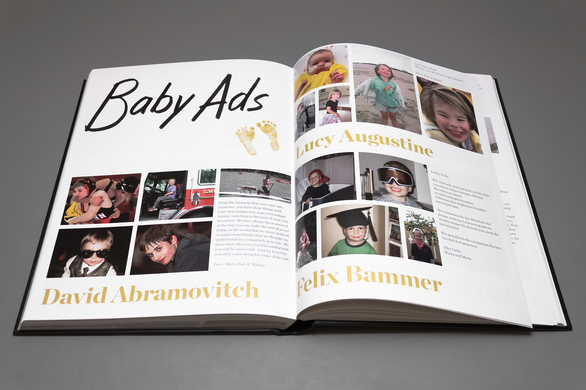
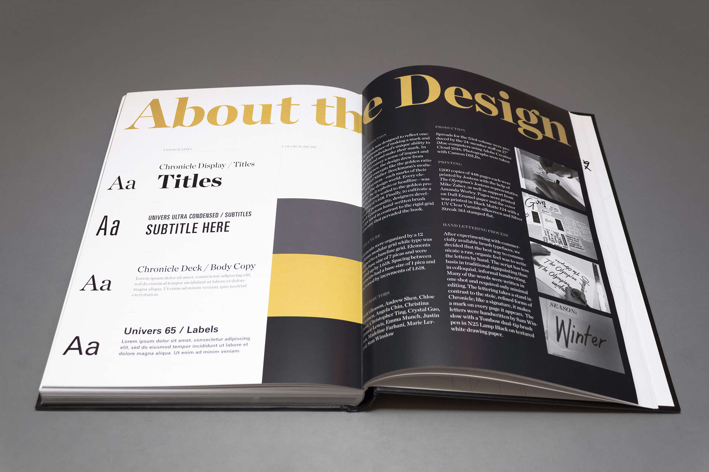
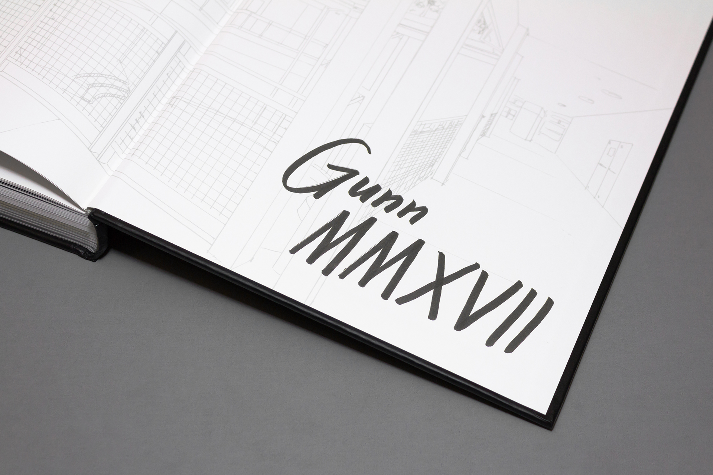
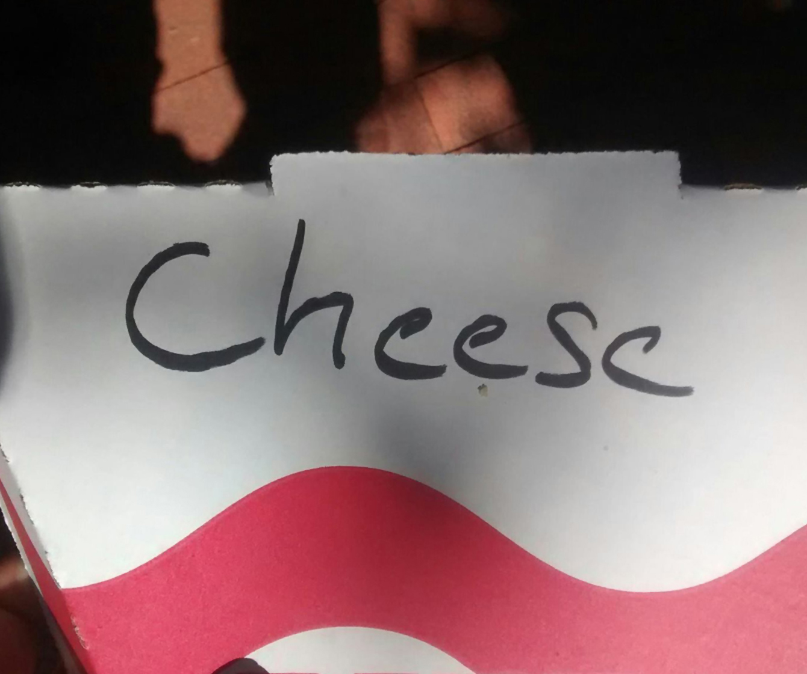
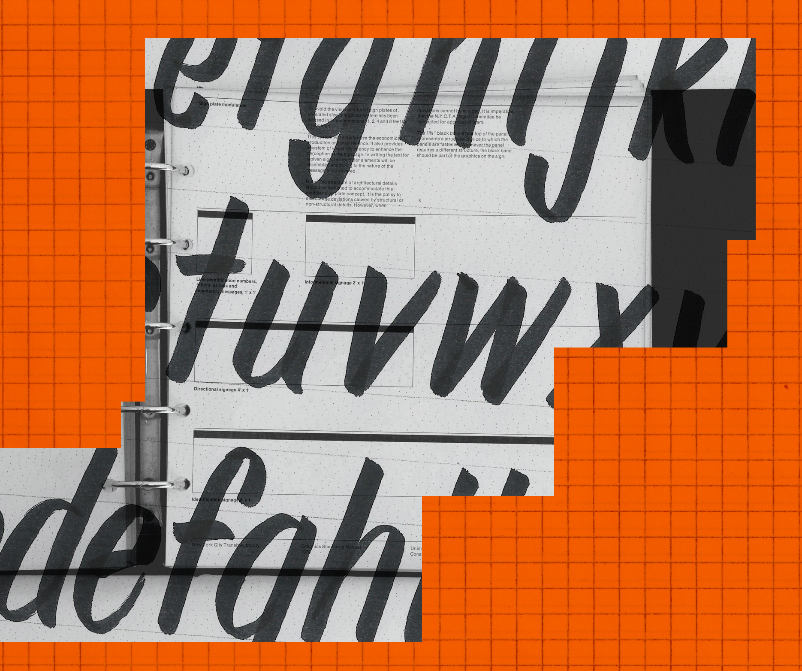

### I created a brush lettering style that complemented the theme of the book. Dozens of finished words appeared throughout the book: on the cover, on the endsheets, and as section titles.

### Because the year’s theme was “Take a Stand, Make a Mark,” the book would highlight students’ individual and collective contributions to the school community. The graphics editor (my good friend Andrew Shen) agreed that an irreverent lettering style, closer to handwriting than calligraphy, was appropriate.

- 
- 
- 
- 

## Concept Development

- 
- 

### &nbsp;
