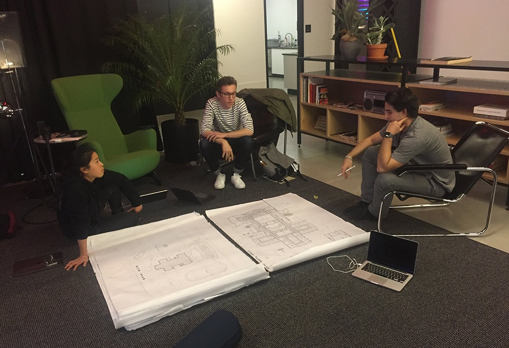
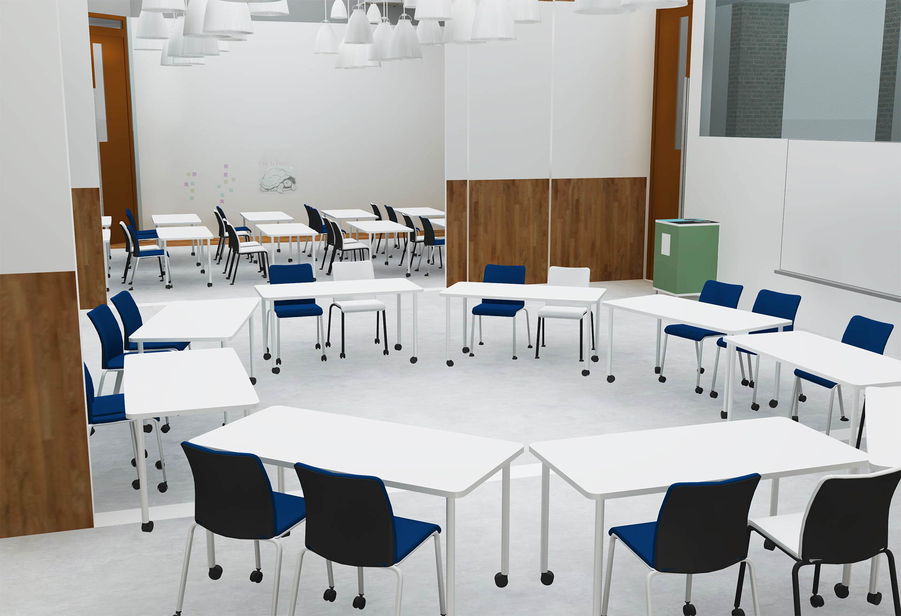

### In February 2018, I joined the Paideia Project, a team of twenty-six students representing every undergraduate college at NYU who worked together to redesign a rural Massachusetts high school and reimagine 21st-century pedagogy. [What does paideia mean?](https://en.wikipedia.org/wiki/Paideia)

### We identified pain points in the high school which reflect issues endemic to the current American school system: lack of funding to support creative and entrepreneurial skills, a stifling curriculum centered around lecture and standardized tests, and oppressive, uninspiring physical spaces. In broad strokes, our new school would be dynamic, living, and digital, in every aspect: from the curriculum, to the architecture, to the organizational structure.

### &nbsp;

## The existing high school
- 
- 
- 
- 

- 
- ### I took charge of redesigning the interiors of the school’s classrooms, out of a belief that openness and adaptability of a space could instill those same values in its users. See the original plan for the classroom wing at left.

## The new classrooms

- 
- ### An overview of the redesigned classroom wing, featuring movable walls for modular classroom arrangements and a central “breakout space” to support the individual and project-based aspects of the proposed curriculum.

- 
- 

### The Massachusetts high school has funding in place to make investments in the architecture and technological resources over the next few years. The district has been very receptive to our design suggestions and moonshot “what-ifs.”

### Owing to our outreach, NYU Steinhardt's School of Education has begun offering elective courses in sustainable design for education, and problem-based learning models.

### &nbsp;
