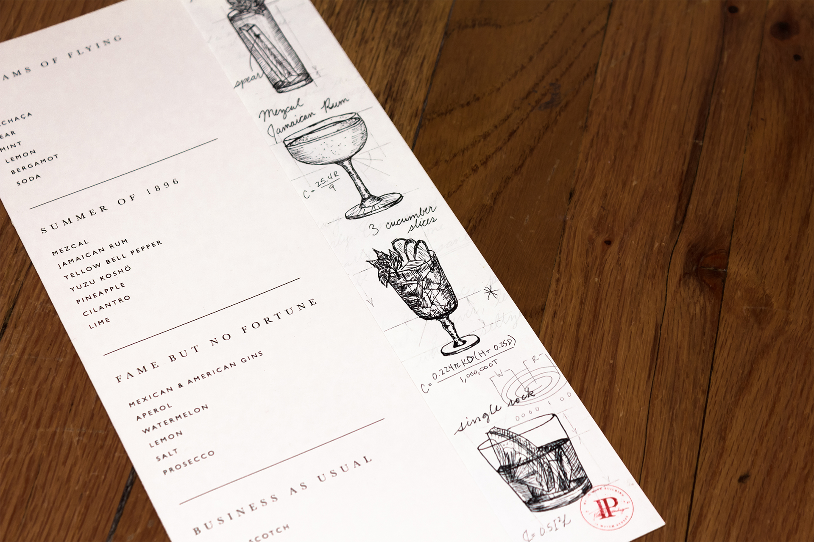

### While at Simmer Group, I drew cocktail illustrations for the summer drink menu of Patent Pending, a speakeasy concept located in the Radio Wave Building, Flatiron, NYC. It is named after the location of Nikola Tesla’s first experiments with radio waves.

- 
- 

###  
