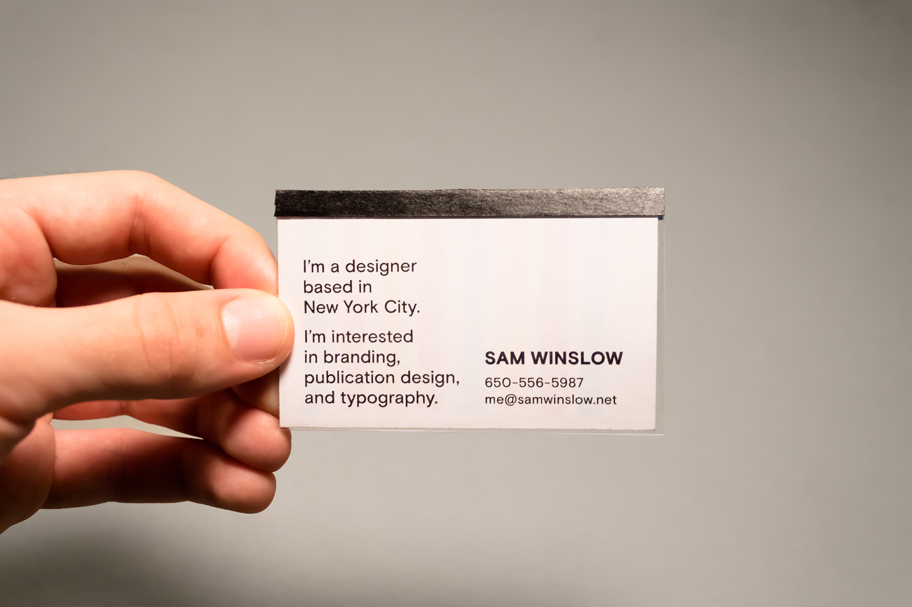
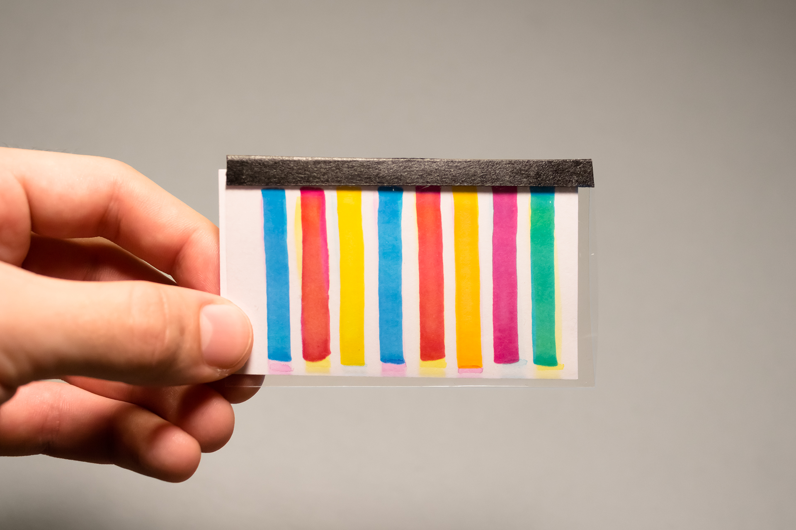
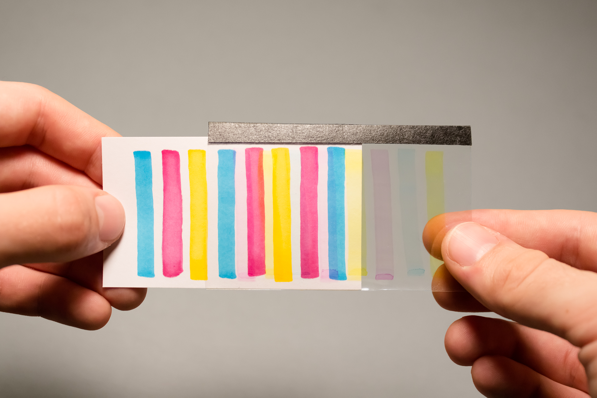
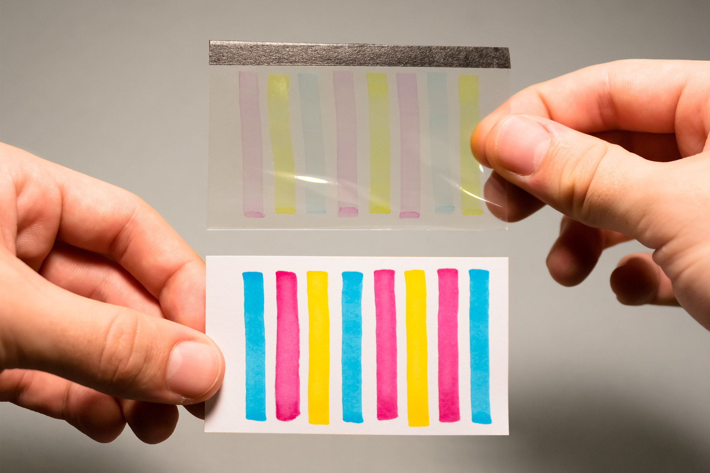
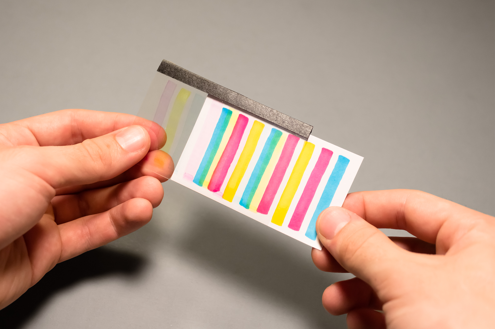

### I created personal business cards which employ subtractive color theory (mixing of cyan, magenta, and yellow) to create an analog interactive experience. The mode of interaction is inspired by Stefan Sagmeister’s [lenticular business card](https://sagmeisterwalsh.com/work/all/sagmeister-inc-business-card-one/).

- 
- 
- 
- 

### &nbsp;
